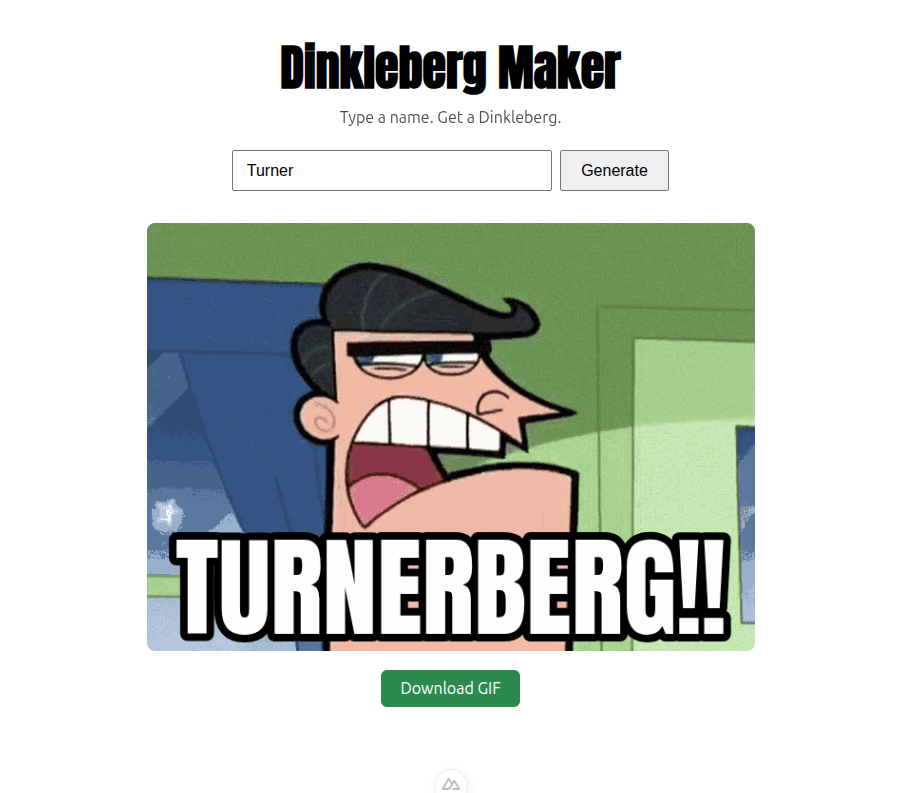

# Dinkleberg Maker

Type a name, get a downloadable Dinkleberg meme GIF. `{NAME}BERG!!` baked onto a clean, caption-free clip of the classic *Fairly OddParents* growl, styled to match the original burned-in text, entirely in the browser.



## Why

A running joke at work. Whenever something broke, someone's name went on the Dinkleberg meme and that was that, it was their fault now. Making them by hand in an image editor got old fast, so I spent an afternoon building something that does it in one field and a button.

It's a silly project. The part worth looking at is that all of it happens client-side: decode the GIF, draw the caption onto every frame, re-encode, hand you a download. Nothing is uploaded and there's no backend.

## Setup

```bash
npm install
npm run setup   # one-time: fetches the GIF, font, and gif.js worker into public/
npm run dev     # http://localhost:3000
```

The source GIF and the Anton font aren't committed. `npm run setup` pulls them into `public/`, and you can point it elsewhere with the `SOURCE_GIF_URL` and `FONT_URL` env vars.

## How it works

| File | Does |
|---|---|
| `utils/caption.ts` | Turns a name into the caption. `Smith` → `SMITHBERG!!` |
| `utils/layout.ts` | Picks a font size and wraps the line so it fits the GIF width |
| `utils/gif-baker.ts` | Decodes with `gifuct-js`, draws each frame plus caption on a canvas, re-encodes with `gif.js` |
| `pages/index.vue` | The one screen |

Both `gif.js` and `gifuct-js` are browser-only, so they're dynamically imported inside client-side paths and never touch SSR.

## Two things that were fiddlier than expected

**Fitting the caption.** The original meme has the text burned in at a size that suits the word "DINKLEBERG". Names are longer and shorter than that, so `layoutCaption` walks the font size down until the line fits the frame width, with a floor so a very long name wraps instead of becoming unreadable. Getting the minimum-size edge case right took more attempts than the rest of the file.

**Re-encoding without freezing the tab.** `gif.js` encodes in a web worker, which keeps the UI responsive, but the worker script has to be served from `public/` rather than bundled. That's why `npm run setup` fetches `gif.worker.js` alongside the assets. The encoder also reports failure by callback rather than by rejecting, so `bakeGif` wraps it to reject properly instead of hanging forever on an error.

## Tests

```bash
npm test         # unit (Vitest): caption transform, layout maths
npm run test:e2e # browser smoke test (Playwright): type a name, get a GIF back
```

The e2e test waits for Nuxt to finish hydrating before typing. Filling an input before hydration looks like it works and then gets silently reverted when `v-model` takes ownership, which makes for a confusing red build.

## Licence

Code is ISC. The source GIF is a frame from *The Fairly OddParents* and belongs to its owners; it's fetched at setup rather than redistributed here. [Anton](https://fonts.google.com/specimen/Anton) is under the SIL Open Font License.
